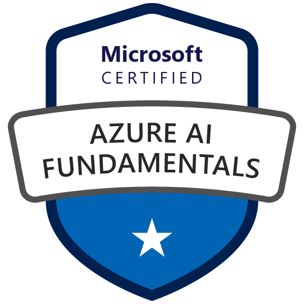
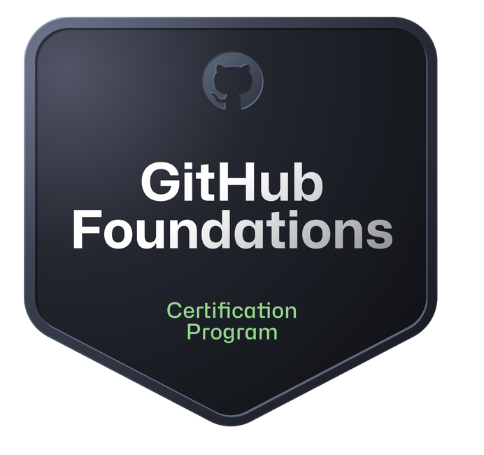

# 💻 Aman Hordofo

### Principal Software Engineer • Adjunct Instructor • AI, Cloud & Web Technologies Specialist

A seasoned software engineering leader with over 20 years of experience designing, architecting, and delivering enterprise-grade cloud applications and high-performance web systems. Proven expertise in leading cross-functional developer teams, driving modern DevSecOps practices, and bridging industry innovation with academia through computer science instruction.

---

## 🧭 Contacts & Profiles

  
  
  
  

---

## 🛠️ Technical Skills

| Category | Skills & Technologies |
| :--- | :--- |
| **Languages** | `TypeScript` • `JavaScript (ES6+)` • `Java` • `PHP` • `HTML5` • `CSS3` • `SQL` |
| **Frontend Frameworks** | `Angular (2+)` • `React` • `Next.js` • `RxJS` • `State Management` |
| **Backend & Databases** | `Spring Boot` • `Laravel` • `RESTful APIs` • `MySQL` • `PostgreSQL` |
| **Cloud & DevOps** | `AWS` • `Azure` • `GitHub Actions` • `GitLab CI` • `CI/CD Pipelines` • `Docker` |
| **AI & Emerging Tech** | `Azure AI` • `Generative AI Integration` • `Large Language Model APIs` |
| **Leadership & Core** | `SDLC & Agile` • `Software Architecture` • `Technical Mentorship` • `Team Leadership` |

---

## 🧩 Experience

### 💼 Medtronic — _Minneapolis, MN_
**Principal Software Engineer**  
📅 _Nov 2025 – Present_

- **AI & Frontend Architecture**: Architect and build high-performance digital health portals and internal tools using Next.js and React, integrating state-of-the-art Generative AI capabilities.
- **RAG & Vector Databases**: Design and deploy Retrieval-Augmented Generation (RAG) pipelines leveraging MongoDB Vector Search to query high-dimensional medical and enterprise datasets with low latency.
- **Agentic AI Systems**: Spearhead the implementation of Agentic AI workflows and LLM orchestration layers to automate complex diagnostic, reporting, and operational decisions.
- **Compliance & Security**: Ensure AI-driven platforms comply with strict medical device standards (IEC 62304), HIPAA guidelines, and data privacy frameworks, implementing secure data access and encryption.
- **Engineering & Mentorship**: Establish development practices for Next.js application structure and AI systems integration, mentoring engineering teams on testing and scaling AI solutions.

---

### 💼 State of Minnesota — _Saint Paul, MN_
**Lead Application Developer**  
📅 _Aug 2025 – Dec 2025_

- **Technical Leadership**: Led a team of Angular developers within Minnesota IT Services (MNIT), supporting mission-critical digital systems for the Minnesota Pollution Control Agency (PCA).
- **Application Architecture**: Spearheaded the technical architecture, modular design, and robust implementation of enterprise-grade, large-scale Angular applications.
- **Standards & Best Practices**: Defined comprehensive standards for coding, automated testing, UI component isolation, bundle size optimization, and performance tuning.
- **Mentorship & Code Quality**: Conducted regular code reviews, mentored engineers on TypeScript, RxJS, and clean architecture, and aligned engineering outcomes with state accessibility requirements.

**Senior Application Developer**  
📅 _Sep 2019 – Aug 2025_

- **Enterprise Development**: Built and maintained reliable, highly scalable web solutions aligning with the state's QA standards and the Software Development Life Cycle (SDLC).
- **Cross-Team Collaboration**: Provided technical direction and architecture guidance to development teams spanning multiple state agencies.
- **Documentation & Standards**: Drafted and maintained technical designs, API schemas, and deployment documentation adhering to rigorous MNIT project standards.
- **Execution & Administration**: Managed and prioritized complex development workloads, environment configurations, and deployment schedules in an Agile/Scrum environment.

---

### 🎓 Minneapolis College — _Adjunct Instructor_
📅 _Sep 2024 – Present_

**Department of Information Technology**
- **Java Programming (ITEC 2545)**: Instruct students on Java fundamentals, object-oriented concepts, algorithms, and application design.
- **MySQL Database Design (ITEC 1465)**: Teach database design principles, normalization, writing complex SQL queries, and backend database implementation.
- **Curriculum & Mentorship**: Design coursework, projects, and assessments that bridge theoretical computer science with real-world industry requirements.

---

### 🎓 Anoka-Ramsey Community College — _Adjunct Instructor_
📅 _Sep 2022 – Present_

**Department of Computer Science**
- **Database Systems (CSCI 1201)**: Deliver lectures and practical labs on relational database concepts, schema design, and query optimization.
- **Object-Oriented Programming (CSCI 1125)**: Instruct OOP design principles using Java, including inheritance, polymorphism, encapsulation, and exception handling.
- **Student Mentorship**: Guide students through coding projects, debugging practices, and career paths in software engineering.

---

### 💼 RISH LLC — _Founder / CEO_
📅 _Sep 2021 – Present_

- **Consulting Services**: Provide software consulting, solution architecture, and strategic technology advisory services to clients.
- **Full-Stack Projects**: Lead custom software development projects from initial requirements gathering to deployment, leveraging modern web frameworks and cloud infrastructure.

---

### 💼 G2Planet — _Software Engineer_
📍 Minneapolis, MN  
📅 _Jul 2015 – Sep 2019_

- **Product Engineering**: Acted as the lead developer for **EventEXPRESS** and **EventMAX 2.0** enterprise event management platforms.
- **Tech Stack**: Built modular frontend components and backend services using Angular 6, Laravel, PHP, and MySQL.
- **CI/CD & Collaboration**: Built and optimized automated builds and tests using GitLab CI, ensuring smooth, high-velocity deployments across teams.

---

### 💼 DKS Systems — _Web Developer_
📍 Golden Valley, MN  
📅 _May 2014 – Jul 2015_

- **Web & eCommerce Development**: Engineered responsive websites, scalable eCommerce applications, and bespoke plugins/integrations for diverse business clients.
- **Performance Optimization**: Tuned database structures and refactored client-side code, drastically reducing load times and improving SEO metrics.
- **Rapid Delivery**: Handled multiple client projects concurrently, consistently meeting strict deadlines in a fast-paced agency environment.

---

### 💼 Entegee — _Application Developer_
📍 New Hope, MN  
📅 _Feb 2013 – May 2014_

- **Application Development**: Developed, refactored, and maintained eCommerce websites and dynamic business tools utilizing core web technologies and MVC patterns.

---

## 🎓 Education

- **Master of Science in Software Engineering**  
  🏫 _Minnesota State University, Mankato_ | 📅 _2024 – Present_
- **Bachelor of Science in Computer Science**  
  🏫 _Minnesota State University, Mankato_ | 📅 _2003 – 2007_

---

## 🏅 Certifications

| Certification | Badge | Credential Verification |
| :--- | :---: | :---: |
| **AWS Certified Cloud Practitioner** |  | [Verify via Credly](https://www.credly.com/badges/7c4471e6-c1e5-4dae-8104-783a051a24e6) |
| **Microsoft Certified: Azure Fundamentals** |  | [Verify via Microsoft](https://learn.microsoft.com/api/credentials/share/en-us/getamano/49EE50CEE5E080BA?sharingId) |
| **Microsoft Certified: Azure AI Fundamentals** |  | [Verify via Microsoft](https://learn.microsoft.com/api/credentials/share/en-us/getamano/BC77473BA0EF6A9E?sharingId=C39555B6073D61C4) |
| **GitHub Foundations** |  | [Verify via Credly](https://www.credly.com/badges/ed28cad3-dce5-4cae-8104-783a051a24e6) |

---

## 🌱 Key Interests

- **Advanced Software Architecture**: Designing high-throughput, microservice-based web platforms.
- **Artificial Intelligence**: Integrating Generative AI, machine learning APIs, and AI agent capabilities into software workflows.
- **Cloud Engineering**: Building multi-region serverless and containerized solutions on AWS & Azure.
- **Technical Education**: Elevating technical literacy and engineering principles in college classrooms.
